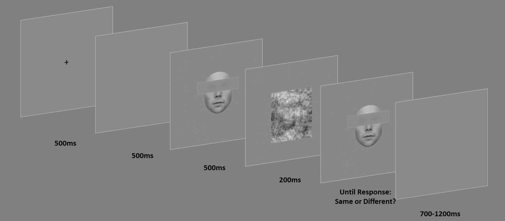

In this experiment, we are testing whether the amount of contrast in the
eye region influences contextual modulations in face processing.

We manipulate the contrast using an occluder around the eyes and brows. The
contrast is defined by a staircase in each condition (orientation
(upright/inverted) * context (same/different/isolated)).

The experiment uses a delayed matching paradigm where the participant needs to
report whether the eye region of the two subsequently displayed face images are
identical or not.

The stimuli are available on [this link](https://osf.io/zd48m)

